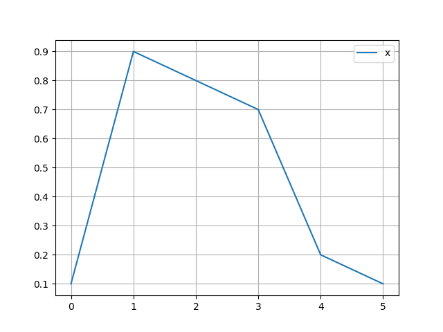
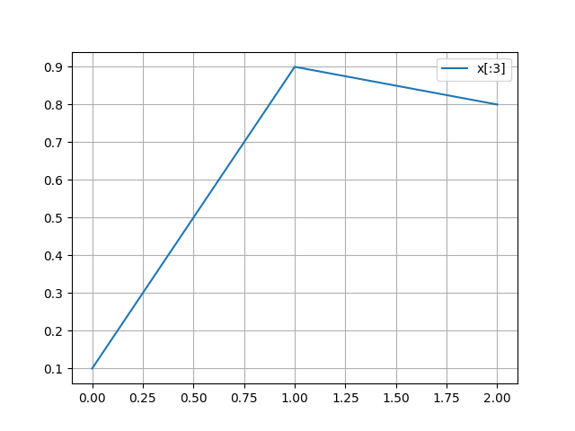
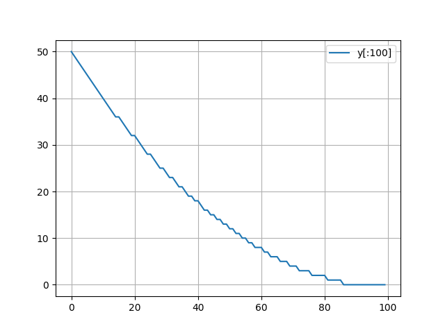
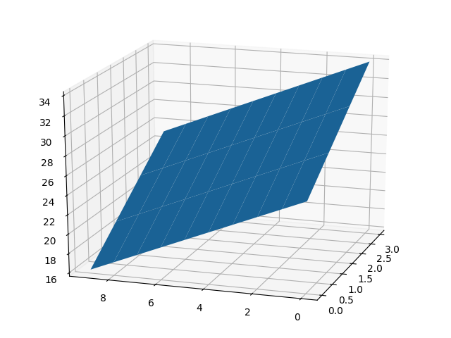

# GDBplotlib

GDBplotlib is an extension to GDB which enables easy visualisation and exporting of data structures. The current implementation is focused on C++, although it could theoretically be extended to work with any language supported by GDB. [Ken Mankoff](https://github.com/mankoff) has created a fork that adds Fortan support, which can be found [here](https://github.com/mankoff/gdbplotlib/tree/fortran).

## Features

* Many different visualisations, such as line graphs, scatter plots and histograms
* Exporting of variables in `.mat`, Python pickle and binary formats
* Works for arbitrarily nested data structures
* Slice support
* Can be easily extended to work with any custom type

## Requirements

* GDB >= 7.0
* Python 3
* NumPy
* Matplotlib
* Scipy (OPTIONAL - for exporting to `.mat`)

## Installation

GDBplotlib can be installed via `pip`:

```bash
$ pip install gdbplotlib
```

To make GDBplotlib available in GDB sessions, add the following lines to `~/.gdbinit` (or create it if it doesn't exist):

```bash
python
import gdbplotlib
end
```

## Usage Examples

Consider the following C++ program:

```cpp
#include <vector>
#include <array>

int main()
{
    std::array<double, 6> x = {0.1, 0.9, 0.8, 0.7, 0.2, 0.1};

    int* y = new int[100];
    for (int i = 0; i < 100; ++i) {
        y[i] = 50 - i + int(5e-3 * i * i);
    }

    std::vector<std::array<int*, 10>> z(10);
    for (int i = 0; i < z.size(); ++i) {
        for (int j = 0; j < z[i].size(); ++j) {
            z[i][j] = new int[10];
            for (int k = 0; k < 10; ++k) {
                z[i][j][k] = i + 2*j + 3*k;
            }
        }
    }

    return 0;
}
```

To create a line graph of `x`, execute the command:

```
plot x
```


GDBplotlib has full support for Python-style slicing. For example, to plot only the first 3 elements, simply execute:

```
plot x[:3]
```


Pointers are an example of an unbounded type - that is a type for which it is not possible to deduce the number of elements. In order to correctly plot the variable `y`, the user must explicitily give an endpoint using the slice syntax:

```
plot y[:100]
```


Note that when slicing an unbounded type, negative start/end slice indices no longer refer to an index relative to the container's end (as in Python), but rather relative its start (as in C indexing).

GDBplotlib supports data extraction of arbitrarily nested structures. For example, to create a 3D plot of `z`, run:

```
plot3d z[::-1,2,4:8]
```


## Supported Types

* `std::vector`
* `std::array`
* C-style array
* Pointer
* All integral and floating point types
* `std::complex<float>` and `std::complex<double>`

## Supported Commands

* `plot VAR...` - Create a 1D line plot of `VAR`, where `VAR` is any 1D or 2D structure
* `plot3d VAR` - Create a 2D surface plot of `VAR`, where `VAR` is a 2D real-valued structure
* `scatter VAR...` - Create a 2D scatter plot of `VAR`, where `VAR` is either a 1D complex-valued structure, an N-by-2 real-valued structure, or two 1D real-valued structures
* `scatter3d VAR...` - Create a 3D scatter plot of `VAR`, where `VAR` is either an N-by-3 real-valued structure, or three 1D real-valued structures
* `hist VAR...` - Create a histogram plot of `VAR`, where `VAR` is any 1D or 2D structure
* `fft VAR...` - Create a power spectral density plot of `VAR`, where `VAR` is any 1D structure
* `save FILE VAR` - Save `VAR` to the file `FILE` in binary format
* `savepy FILE VAR` - Save `VAR` to the file `FILE` in Python pickle format
* `savemat FILE VAR...` - Save `VAR` to the file `FILE` in Matlab format

## Custom Types

It is easy to extend GDBplotlib to handle any desired type. Let's look at an example of how we might implement support for `std::vector`:

```python
from gdbplotlib.type_handler import TypeHandler
from gdbplotlib.default import default


class StdVector(TypeHandler):
    @staticmethod
    def can_handle(gdb_type: gdb.Type) -> bool:
        return str(gdb_type).startswith("std::vector")

    def shape(self, gdb_value: gdb.Value) -> Tuple[Optional[int], ...]:
        size = int(gdb_value["_M_impl"]["_M_finish"] - gdb_value["_M_impl"]["_M_start"])
        return (size,)

    def contained_type(self, gdb_value: gdb.Value) -> gdb.Type:
        return gdb_value.type.template_argument(0)

    def extract(self, gdb_value: gdb.Value, index: Tuple[int, ...]):
        return (gdb_value["_M_impl"]["_M_start"] + index[0]).dereference()


default.register(StdVector)
```

To handle a custom type, we must create a class derived from the abstract base class `gdbplotlib.TypeHandler`. There are 4 methods that need to be overriden:

* `can_handle` - Given a type, determine whether this handler is able to handle it. For a `std::vector`, we want to handle any type whose name begins with `std::vector`
* `shape` - Given a value of our type, return the shape (in the NumPy sense) of the container as a tuple. The length of the tuple is equal to the number of dimensions of our type, and the values are size of the given dimension. If a given dimension has an unbounded size (as in the case of a pointer), that dimension should be given a value of `None`. A `std::vector` is 1-dimensional, with a size equal to the difference between the start and end pointers.
* `contained_type` - Given a value of our type, return the type of any contained elements. This is usually either a fixed type, or one of the type's template arguments. For a `std::vector`, it is the first template argument.
* `extract` - Given an index, extract an element from the container. The `index` parameter is an `n`-length tuple, where `n` is the number of dimensions of the container. For a `std::vector`, we increment the start pointer by the first (and only) index, and dereference to get the value.

Finally, we register our type handler with GDBplotlib so that it can be used with any command. Note that we register the class itself, not its instantiation.

```python
class Float(ScalarTypeHandler):
    @staticmethod
    def can_handle(gdb_type: gdb.Type) -> bool:
        return str(gdb_type) == "float"

    def extract(self, gdb_value: gdb.Value, index: Tuple[int, ...]):
        return np.float32(gdb_value)
```

Handling a custom scalar type is a similar process. The main difference is that we derive from `gdbplotlib.ScalarTypeHandler`. As a result, it is not necessary to override `shape` and `contained_type`. Then, in the `extract` method, we extract the value and return it as a NumPy data type.

The implemntation of a custom type handler relies heavily on the GDB Python API, particularly `gdb.Value` and `gdb.Type`. Documentation for the API can be found at the following [link](https://sourceware.org/gdb/current/onlinedocs/gdb/Python-API.html).

## Acknowledgements

Special thanks to [Brian Hone](https://github.com/bthcode), whose [gdb-plot](https://github.com/bthcode/gdb-plot) served as the inspiration for this project.